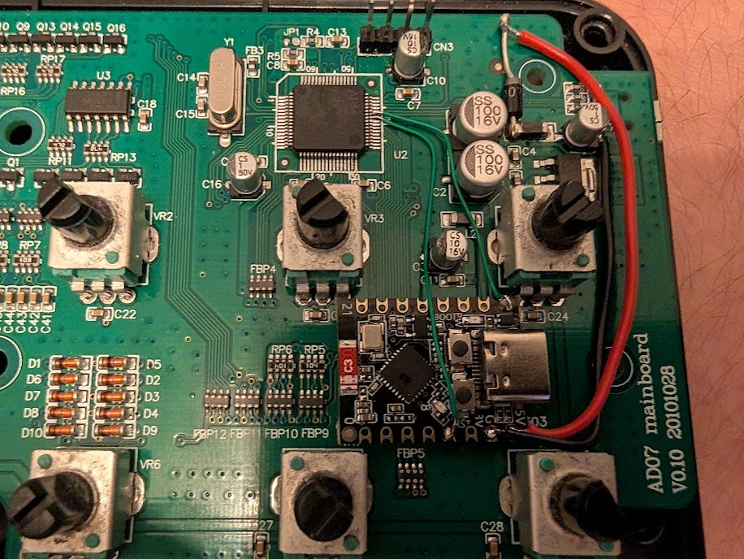

# MPK mini mk1 Open Source Firmware & BLE MIDI Bridge

This repository contains the open-source firmware for the AKAI MPK mini mk1 (STM32F102R8T6) and the accompanying ESP32-C3 Bluetooth LE MIDI bridge. Together, they enable wireless MIDI connectivity for the keyboard while maintaining full compatibility with the original hardware features.

The repository is organised into two main parts:
- `stm32/`: The main keyboard firmware (STM32F102).
- `esp32/`: The Bluetooth LE MIDI bridge (ESP32-C3).

Both processors can be **updated and backed up from a web page the bridge
hosts itself** — no debugger, no host software, no cable. See
[Firmware updates](#3-firmware-updates).

Both firmwares take their version from `version.txt` at the root of this
repository, so a running unit reports the same number the sources carry.
Current version: **1.1.0**.

### Status

Running on a real AD07 board. Measured there:

| | |
|---|---|
| Uploads over USB MIDI, each through the restart into recovery | 12 / 12 |
| Downloads, every byte compared against the build | 28 / 28 |
| Bridge self-updates over WiFi | 4 / 4 |
| Full cycle through the web page, upload and download | 1 / 1 |

Also verified: the resident image installed over SWD, the boot gate
rejecting a slot it should, the program store surviving every update, and
the instrument playing normally afterwards — the USB endpoint changes
underneath all of this did not disturb keys, pads or knobs.

Not verified: BLE MIDI since the bridge's UART transmit lock was added,
the battery-powered supply variants, and any board revision other than
AD07.

---

## 1. STM32 Firmware (Keyboard)

This firmware is a from-scratch replacement for the application in the AKAI MPK mini mk1.

### Features
- **Full Compatibility**: Maintains original USB MIDI identity, note/velocity formulas, and matrix scanning.
- **Extended Features**: Selectable velocity curves, SysEx editor support, and custom boot signature.
- **BLE Integration**: Simultaneously supports USB MIDI and bidirectional BLE MIDI via an ESP32-C3 bridge.
- **Arpeggiator**: Built-in arpeggiator with multiple modes and external MIDI clock support.
- **Field updatable**: New firmware is uploaded over the MIDI link from the
  bridge's web page, and the installed image can be downloaded back off the
  keyboard for a backup.

### Flash layout

The firmware builds as **two images**, and they are flashed differently.

```
0x08000000  stock AKAI updater                  8 KiB  untouched
0x08002000  resident: loader + recovery app    22 KiB  SWD, once
0x080077fe  stock updater's checksum halfword
0x08007800  program store                       1 KiB
0x08008000  application slot                   26 KiB  update target
0x0800e800  application trailer                 1 KiB  update target
```

The stock AKAI updater validates an additive checksum over
`0x08002000..0x080077fd` and jumps through the vector table at `0x08002000`.
Anything in that region therefore cannot be rewritten in the field — a torn
write there fails the stock checksum and strands the unit in an updater that
only speaks USB. So that region holds the part that never changes (a small
loader plus a minimal recovery application), and the real application lives
above the program store, outside everything the stock updater inspects.

On reset the loader checks the trailer — magic, length, and a CRC-32 over the
whole image — plus the slot's first two vectors, and only then hands over. An
update erases the trailer first and writes it last, so at every instant in
between there is no bootable application and the loader stays in recovery.
**An interrupted update cannot brick the keyboard.**

**Recovery mode** plays nothing and sweeps a single light back and forth
across the pad LEDs. It brings up USB MIDI, the ESP32 link and the SysEx
layer — enough to be found and uploaded to. The PROGRAM hold still opens the
editor there, which matters, because that is how you get an application back
in. Holding **TAP TEMPO** at power-on forces recovery even when the installed
application is valid; that is the way back from an image that passes its CRC
but does not work.

### Build
**Requirements**: `arm-none-eabi-gcc` and `make`.

```bash
cd stm32
make
```
Outputs:
- `build/mpk-mini-open.bin` — the application, for `0x08008000`. This is what
  the web page uploads.
- `build/mpk-mini-open-trailer.bin` — 16 bytes for `0x0800e800`, needed only
  when flashing the application over SWD. Over the air the keyboard writes
  this itself, after checking the image.
- `build/mpk-mini-resident.bin` — the loader and recovery application, for
  `0x08002000`.

Prebuilt copies of all three are in `stm32/releases/`, with `SHA256SUMS`.

The Makefile tracks header dependencies (`-MMD -MP`). Without that, editing a
header left stale objects behind and produced an image that was a mixture of
two builds — which is exactly as confusing to debug as it sounds.

### Flash (first install, over SWD)

The stock AKAI updater must already be present at `0x08000000..0x08001fff`.
The resident image replaces whatever is currently at `0x08002000`, including
an earlier single-image build of this firmware.

```bash
cd stm32
openocd -f interface/cmsis-dap.cfg -f target/stm32f1x.cfg \
  -c "adapter speed 1000" -c "init" -c "reset halt" \
  -c "flash write_image erase build/mpk-mini-resident.bin 0x08002000 bin" \
  -c "verify_image build/mpk-mini-resident.bin 0x08002000 bin" \
  -c "reset run" -c "shutdown"
```

That alone leaves the unit in recovery, which is a working state — it
enumerates over USB and answers the bridge. From there, upload
`build/mpk-mini-open.bin` from the web page and the keyboard installs it
itself. That is the path every later update takes.

To flash the application over SWD instead, write the image **and its
trailer**; without the trailer the loader has nothing to validate and stays
in recovery.

```bash
openocd -f interface/cmsis-dap.cfg -f target/stm32f1x.cfg \
  -c "adapter speed 1000" -c "init" -c "reset halt" \
  -c "flash write_image erase build/mpk-mini-open.bin 0x08008000 bin" \
  -c "flash write_image erase build/mpk-mini-open-trailer.bin 0x0800e800 bin" \
  -c "verify_image build/mpk-mini-open.bin 0x08008000 bin" \
  -c "reset run" -c "shutdown"
```

Do not flash either image at `0x08000000`; that would overwrite the retained
updater. The program store at `0x08007800` sits outside both images and
survives every update.

### Updating without the bridge

`stm32/tools/upload.py` talks the same protocol straight down the keyboard's
own USB MIDI port. Useful on a bench, when the ESP32 is not fitted, and when
the bridge itself is what is being worked on.

```bash
stm32/tools/upload.py auto query
stm32/tools/upload.py auto write stm32/build/mpk-mini-open.bin
stm32/tools/upload.py auto read  backup.bin
```

It handles the restart into recovery for you, reconnecting after the keyboard
re-enumerates, and verifies a download against the checksum the keyboard
reports.

### Tests

```bash
cd stm32/test && make check
```

Host-side, no hardware. Covers the velocity curves, the PROGRAM hold, and the
firmware transfer — including that an upload interrupted at **any** chunk
boundary never leaves a bootable half-image, that a CRC mismatch refuses to
commit, and that the boot gate rejects wrong magic, torn trailers, single-bit
flips and bad vector tables. `ota.c` goes into both firmwares and behaves
differently in each, so it is built and tested twice: as recovery, which does
the transfer, and as the application, which must refuse it and hand over.

The transfer code reaches flash only through `flash.h`, so it runs against an
array that enforces what NOR flash enforces: erased bytes read `0xff`,
programming only clears bits, and a write to an unerased halfword fails. A
test that passes is not passing because the stand-in was more forgiving than
the hardware. The transfer code reaches flash only through
`flash.h`, so it runs against an array that enforces what NOR flash enforces:
erased bytes read `0xff`, programming only clears bits, and writing to an
unerased halfword fails.

---

## 2. ESP32-C3 BLE MIDI Bridge

This project turns an **ESP32-C3 SuperMini (HW-466AB)** into a bidirectional BLE MIDI transport.

### Parts List
- **ESP32-C3 SuperMini** (HW-466AB or equivalent), USB-C.
- **Diode**: 1N5819 (Schottky) or 1N4007.
- **Capacitor (Optional)**: 100 µF electrolytic (10 V or higher) for power stability.

### Build and Flash
**Requirements**: ESP-IDF (v6.0.3).

```bash
cd esp32
idf.py set-target esp32c3
idf.py build
idf.py -p /dev/ttyACM0 flash monitor
```

`partitions.csv` declares **two application slots** plus `otadata`, so the
bridge can update itself over WiFi. A partition table cannot be changed over
the air, so a bridge running an older layout needs one last `idf.py flash`
over USB-C to adopt it. `nvs` keeps its offset and size, so BLE pairings
survive that.

A prebuilt image is in `esp32/releases/`.

### Tests

```bash
cd esp32/test && make check
```

Three suites against stub ESP-IDF and NimBLE headers. The BLE suite round-trips
MIDI through the parser, queue and packet builder. The editor suite drives the
HTTP handlers against a fake keyboard. The firmware-update suite runs **both
real ends against each other** — the bridge's sender from `esp32/src` and the
keyboard's receiver from `stm32/src` — so the two cannot disagree about the
wire format without a test failing.

### Bringing-up Order
1. **Flash the ESP32 alone** (unplugged from keyboard). It should advertise as `MPK mini Open`.
2. **Bench-wire the signals** (GND, TX, RX) with separate USB power for each board.
3. **Connect power** via the diode (see below) and verify USB MIDI from the keyboard still works.

### Editor Portal
Press and hold the keyboard's **PROGRAM** button for two seconds to start the
WiFi editor. You can also press the **BOOT** button on the ESP32-C3. Use the
same action again to stop it.

- **SSID**: `MPK-mini-Open`
- **Password**: `mpkmini1`
- **Address**: `http://192.168.4.1/`

The editor should open automatically through captive-portal discovery after
you join the network. If it does not, open the address above in a browser.
This allows you to edit velocity curves and programs without installing host
software.

---

## 3. Firmware Updates

Open the editor (hold **PROGRAM** for two seconds), join `MPK-mini-Open`, and
use the **Firmware** panel. It shows what is installed on each side.

| | Upload | Download |
|---|---|---|
| **Keyboard** | `stm32/build/mpk-mini-open.bin`, ~6 s | reads the installed image back |
| **Bridge** | `esp32/build/mpk_mini_ble_midi.bin`, a few seconds | serves the image it is running |

**Uploading.** The keyboard's image crosses at 31250 baud — the MIDI rate the
UART runs at — so a 14 KB image takes about six seconds. The browser finishes
pushing it into the socket long before that, so the page polls for the real
progress rather than showing an upload bar that would be a lie.

**The keyboard restarts into recovery partway through, and that is normal.**
The application executes from the slot an update has to erase, and a Cortex-M3
cannot run from flash that is being erased — there would be nothing to come
back to. So the application does not attempt the transfer. It gives up its own
bootability and resets; the loader then finds no valid application and runs
recovery, which lives in the resident region and can rewrite the slot safely.
The bridge follows it there automatically and starts again. What you see is
the pad lights change to the recovery sweep for a few seconds, then the new
firmware boot. There is only one application slot — 64 KiB of flash does not
hold two — so giving up the installed image before its replacement arrives is
unavoidable; recovery is what makes that safe rather than frightening.

Either update can be interrupted without bricking anything: the keyboard stays
in recovery and you simply upload again, and the bridge's new image boots on
probation and is rolled back by the bootloader if it never reports itself
healthy.

**Downloading.** You get back exactly the image that is installed. The
keyboard's is read out over the MIDI link and checked against the CRC-32 the
keyboard reports, so a truncated copy is refused rather than saved. The
bridge serves its own running image at its real length, computed by walking
the ESP32 image header — not the whole 1.9 MB partition. Take a copy before
overwriting a build you might want back.

A file offered to the wrong processor is refused before anything is erased:
ESP-IDF images start with `0xe9`, STM32 images start with a stack pointer in
SRAM, and each endpoint checks for the other's signature.

**Robustness.** A transfer is thousands of request/reply exchanges where the
editor previously made one, which turns rare faults into reliable ones. Three
showed up at that rate during bring-up and are handled rather than wished
away:

- The keyboard's **USB MIDI OUT endpoint could be left unable to receive** —
  `STAT_RX` stuck at NAK with no arrival pending — after which the firmware
  runs perfectly and is simply deaf. The endpoint register's `CTR` flags are
  write-0-to-clear, and two masks omitted them, so routine writes discarded
  an arrival that had not been serviced yet. The masks are ST's
  `USB_EPREG_MASK` now, and `usb_poll()` re-arms the endpoint if it ever
  finds that state anyway.

  *That backstop is deliberate and not a diagnosis.* `usb_rearm_count`
  counts how often it has had to act, and on a measured run of about 1000
  request/reply exchanges it fired **twice** — so the underlying fault is
  still live at roughly two occurrences per thousand exchanges, and has not
  been isolated. Every one of those transfers still completed and verified,
  because the backstop restores the endpoint and the senders retry the
  message that was lost while it was wedged. Read the counter over SWD
  (`mdw` on the symbol) to see whether a unit has hit it. Note that it
  resets with the processor, and an upload reboots the keyboard, so measure
  it with downloads.
- Anything the host was delivering while the endpoint was NAKing is
  discarded, so **both senders retry a message that draws no reply at all**.
  A refusal is never retried, only silence; every sub-command is either
  idempotent or resynchronises from the offset the keyboard echoes back, so
  asking again is correct rather than hopeful.
- The **MIDI ring was too small** for the replies this adds. A 141-byte read
  reply inflates to 188 bytes of USB-MIDI framing, pushed in one burst, and
  the original firmware's 240-byte buffer left 52 bytes of slack — one queued
  CC was enough to truncate a reply and stall a download. It is 512 here,
  deliberately larger than stock; nothing outside the firmware can observe
  the size.

---

## 4. Versioning

`version.txt` at the root of this repository is the single source of truth.
The STM32 Makefile turns it into `FIRMWARE_VERSION_*` and the ESP-IDF project
reads it into `PROJECT_VER`, so both halves report the same number and a unit
in the field can be identified from the Firmware panel.

ESP-IDF would otherwise fall back to `git describe`, which reports the state
of whatever working copy the build ran in rather than anything about the
firmware — a bridge built from a dirty tree once advertised itself as
`d229c96-dirty`. Bump `version.txt` and rebuild both; nothing else needs
touching.

---

## 5. Hardware Setup & Wiring

### Signal Wiring (UART Link)
Connect the STM32 and ESP32-C3 directly via TTL (3.3V logic).

| MPK mini STM32 | ESP32-C3 SuperMini | Purpose |
|---|---|---|
| **PA9** (LQFP64 pin 42) | **GPIO4** | STM32 MIDI TX $\to$ ESP RX |
| **PA10** (LQFP64 pin 43) | **GPIO5** | ESP MIDI TX $\to$ STM32 RX |
| **GND** | **GND** | Common Reference |

*Note: On the AD07 board, PA9 and PA10 must be soldered directly to the 0.5 mm-pitch LQFP64 pins.*

### Power Wiring (Keyboard-Powered)
The ESP32-C3 is powered from the MPK's +5V rail via a diode to prevent power conflict when both are connected to USB.

| MPK mini | Component | ESP32-C3 SuperMini |
|---|---|---|
| **+5 V Net** | 1A Diode (Anode to MPK, Cathode to ESP) | **5V Pin** |
| **GND** | Direct Connection | **GND Pin** |



**Important**: Do **NOT** feed the ESP32's `3V3` pin from the MPK's 3.3V rail. Use the `5V` pin to allow the ESP32's onboard regulator to handle the load.
